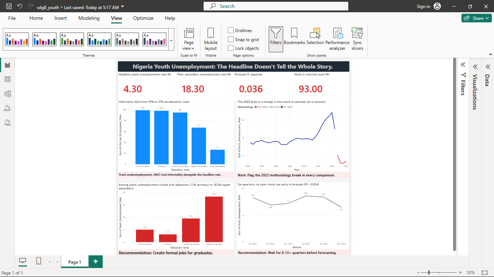

# Nigeria Youth Unemployment: What the Headline Number Hides

An analysis of youth unemployment in Nigeria (ages 15 to 24), written for UN Sustainable Development Goal 8: Decent Work and Economic Growth. It uses public World Bank and National Bureau of Statistics (NBS) data, a Python notebook for the analysis, and a one-page Power BI dashboard that tells the story.

## The short version (For easy understanding)

Nigeria's national unemployment rate (4.3% in Q2 2024) looks low, but it leaves a lot out.

- For young people aged 15 to 24 unemployment is higher, at 6.5%, and almost all of those who work do so informally (98.6%).
- In 2022 the way Nigeria counts workers changed, so figures from before and after 2022 cannot be compared directly.
- Among young people, unemployment rises with education, reaching 18.3% for those with upper secondary education.
- There are not enough data points yet to forecast where the rate is heading, and this project says so instead of guessing.

## Dashboard

The dashboard follows the four findings from top to bottom. The Power BI file is in [`dashboard/sdg8_youth.pbix`](dashboard/sdg8_youth.pbix) and needs Power BI Desktop to open. A PDF copy is in [`dashboard/sdg8_youth.pdf`](dashboard/sdg8_youth.pdf).

## Findings

### 1. A low national rate hides what young people face

The national unemployment rate for Q2 2024 was 4.3%, which suggests almost everyone has work. For people aged 15 to 24 it was 6.5%, about one and a half times higher. Job quality is the bigger problem: 93% of all employed Nigerians work informally, and among employed 15 to 24 year olds the figure is 98.6%. Another 12.5% of young people are not in employment, education or training.

Informality falls as education rises. Across all workers it goes from 99% for people with no education to about 27% for those with post-secondary education.

**Recommendation:** Report youth unemployment, underemployment, NEET rates and informality next to the national rate, not instead of it.

### 2. The 2022 drop is a change in counting, not a recovery

In 2022 Nigeria adopted the 19th ICLS standard, under which anyone who works at least one hour a week counts as employed. The unemployment rate fell after the switch, but the two periods measure different things and should not be compared as one series.

**Recommendation:** Any comparison across 2022 should say clearly that the method changed.

### 3. Among young people, unemployment rises with education

Youth (15 to 24) unemployment by education level in Q2 2024: primary 3.1%, no education 5.0%, lower secondary 9.5%, upper secondary 18.3%. The NBS report gives no youth figure for post-secondary education. The pattern suggests better-educated young people may be waiting for formal jobs that are not being created fast enough, although this data alone cannot prove that.

This is not a simple "more education, more unemployment" story. For all ages combined, unemployment peaks at upper secondary (8.5%) and is lower for post-secondary (4.8%).

**Recommendation:** Job creation programs should target formal-sector jobs that can absorb school leavers and graduates, not only more training.

### 4. The data cannot support a forecast yet

A straight-line trend fitted to six quarterly data points gave an R-squared of 0.036. In plain terms, the line explains only about 3.6% of the ups and downs in the data. The six values (8.3, 6.9, 7.2, 8.6, 8.4, 6.5) show no steady direction.

**Conclusion:** No forecast is published. At least 8 to 12 consistent quarters under the new method are needed before a forecast is worth making.

## Key terms

| Term | Meaning |
|------|---------|
| National unemployment rate | The same measure for everyone aged 15 and over |
| Youth unemployment rate | Share of people aged 15 to 24 in the labour force who are without work but available and looking for it |
| Informal employment | Work without formal contracts or legal and social protections |
| NEET | Young people Not in Employment, Education or Training |
| 19th ICLS | The international labour statistics standard Nigeria adopted in 2022. It counts one hour of work a week as employment |
| R-squared | A score from 0 to 1 for how well a trend line fits the data. Near 0 means it explains almost nothing, near 1 means it fits almost perfectly |

## Data sources

- **World Bank:** annual youth unemployment rate for Nigeria (indicator SL.UEM.1524.ZS), 1991 to 2025.
- **NBS Nigeria Labour Force Survey reports:** youth unemployment and NEET by education level, informality by education level for all workers (Q2 2024, entered by hand from the report's Annex A tables), and the quarterly youth unemployment values from Q4 2022 to Q2 2024.

## How the analysis was done

1. Loaded the World Bank data, reshaped it into one row per year, and removed years with no data.
2. Split the series at 2022 to separate the old and new counting methods.
3. Entered the NBS education table by hand and compared unemployment, NEET and informality across education levels.
4. Fitted a straight-line trend to the six quarterly values and checked it with R-squared.
5. Exported small clean tables to `dashboard_data/` and built the Power BI dashboard from them.

## Tools

| Tool | Used for |
|------|----------|
| Python (pandas, matplotlib) | Cleaning, analysis, charts and the trend model |
| Power BI Desktop | The dashboard |
| Google Sheets | Checking the data files |
| SQL | Planned, not part of this version |

## What is in this repository

| Item | What it is |
|------|------------|
| `sdg8_youth_unemployment.ipynb` | The full analysis notebook |
| `dashboard/` | Power BI file, PDF copy and preview image |
| `dashboard_data/` | The four small CSV files the dashboard reads |
| `NLFS_Q1_2024_Report.pdf`, `NLFS_Q2_2024.pdf` | NBS quarterly labour force reports |
| World Bank files (`API_SL.UEM.1524.ZS...` and the two `Metadata_...` files) | Raw youth unemployment data and its descriptions |
| Annual Nigerian labour force file | Additional source data |

## How to run it

1. Install Python 3, then run `pip install pandas matplotlib jupyter`.
2. Download this repository and keep the data files in the same folder as the notebook, or update the file paths in the first cells.
3. Start Jupyter, open `sdg8_youth_unemployment.ipynb` and run all cells.
4. To view the dashboard, open `dashboard/sdg8_youth.pbix` in Power BI Desktop (Windows).

## Limitations

- Only six quarters of data exist under the new method, and Q4 2023 is missing from the series, so the points are not evenly spaced in time.
- Youth unemployment and NEET by education cover ages 15 to 24, while informality by education covers all workers, so the two should not be read as one group. The report has no youth figure for post-secondary education.
- The results show patterns in the data, not proven causes.
- The World Bank annual series and the NBS quarterly figures come from different sources, so their numbers are not directly comparable.
- The education table was entered by hand from an NBS report, so a typing error is possible.

## Next steps

- Re-run the trend model as more quarterly data is released, and publish a forecast only once 8 to 12 or more consistent quarters exist.
- Add SQL queries for summarizing the data.
- Add underemployment data if it becomes available.

## Author

Benedict Chidiebere, BSc Statistics student and data analyst in training.
LinkedIn: [linkedin.com/in/benedict-chidiebere](https://linkedin.com/in/benedict-chidiebere)
